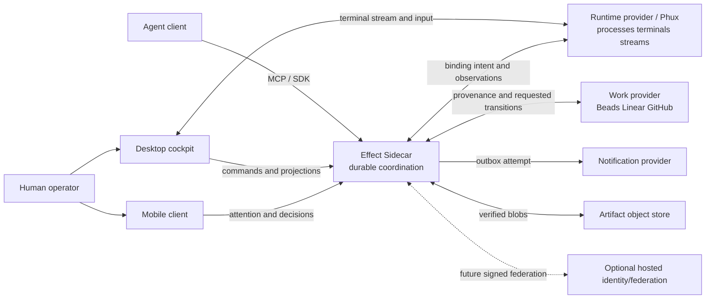
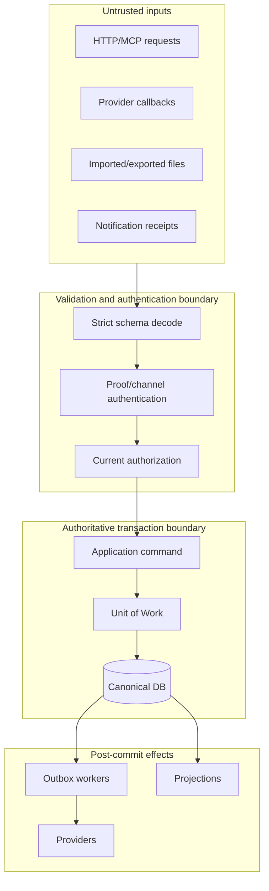

# System context and authority

> **Authority:** Adopted language-neutral invariants plus experimental sidecar boundaries  
> **Related:** [Domain](03-domain-model.md) · [Security](10-security-privacy.md) · [Integrations](11-integrations.md)

## Context

## Authority ledger

| Fact | Authority | Permitted projections |
|---|---|---|
| Sidecar workspace, policy, membership | Sidecar home authority | clients, hosted directory |
| Principal authentication and grants | Sidecar / configured identity authority | session snapshots, audit |
| Actor, delegation and actor-session lifecycle | Sidecar | clients, runtime correlation metadata |
| Objectives, native work units, runs, participation | Sidecar | tracker links, clients |
| Tracker priority, dependencies, status, assignment | Configured work provider | `WorkReference` with provider version and freshness |
| Runtime process/terminal existence and terminal bytes | Runtime provider | binding observations; direct authorized client stream |
| Durable runtime-binding intent/history | Sidecar | runtime receives opaque correlation IDs |
| Conversations, messages, recipient obligations | Sidecar | authorized inbox/search projections |
| Available/read/acknowledged delivery facts | Sidecar, based on authenticated observations | clients |
| Decision and source-condition resolution | Sidecar | attention projections and clients |
| Notification-provider acceptance | Sidecar records provider observation | does not imply device rendering or human action |
| Lease grant, expiry and fence | Sidecar | guards/providers validate; clients show conflicts |
| Terminal input authority | Runtime provider | never inferred from a sidecar lease |
| Artifact metadata/hash/references | Sidecar | bytes live in object-store authority selected by policy |
| Search, unread counts, dashboards | No independent authority | disposable, provenance-bearing projections |
| Organization account/policy ceiling | Future hosted control plane | cached signed grants; local authority enforces ceilings |

## One-writer rule

Every workspace has exactly one writable home authority at a time. `AuthorityID` identifies it and typed `WorkspaceAuthorityEpoch` fences its incarnation. Installation bootstrap/administration uses a distinct `InstallationAdmissionEpoch`; neither type is accepted in the other's scope. Epochs are opaque equality-only random values; clients MUST NOT order or increment them. Every write also validates the current witnessed deployment `storage_writer_generation`.

Promotion, failover, or writable restore MUST establish a witnessed predecessor relationship and durably mint a new epoch before accepting writes. Any component unable to authenticate the current epoch fails closed or declares explicitly advisory behavior.

## Trust zones

No network identity, localhost address, process ID, UID, path, cwd, model name, MCP session, sender string, or terminal identifier authenticates a principal.

## Composition boundaries

### Sidecar ↔ runtime

- Sidecar writes binding intent before requesting a side effect.
- Runtime returns/observes an endpoint, server incarnation, and opaque tagged terminal ID.
- Sidecar never parses provider-private terminal payloads.
- Watcher loss updates health, not binding lifecycle.
- Ambiguous launch enters reconciliation; it is not blindly retried.
- Cockpit subscribes directly to runtime bytes.

### Sidecar ↔ tracker

- Sidecar stores provider, external workspace/object ID, URL, observed version, selected projection, freshness, and provenance.
- Provider-owned fields change only from authenticated observations.
- A requested provider transition remains pending until a later provider version confirms or rejects it.
- No adapter reads provider storage internals.

### Sidecar ↔ Blackbird

There is no live authority relationship. Both may run on one host only with separate ports, storage, credentials and workspaces. Any future read-only diagnostic projection identifies source product, export digest, source version, import time and staleness. It can never authorize a sidecar command.

## Data classes

| Class | Examples | Default treatment |
|---|---|---|
| Public metadata | build version, protocol capabilities | bounded logs/health allowed |
| Operational identifiers | request, trace, opaque resource IDs | logs/traces; never unbounded metric labels |
| Coordination metadata | subjects, participant lists, paths, tracker locators | authorized storage; redacted telemetry |
| Content | messages, decisions, prompts, artifacts | encrypted transport; never telemetry by default |
| Secrets | keys, bearer/proof material, handoffs | vault/protected channels only; never events, argv, env or logs |
| Terminal data | PTY bytes, input | excluded from Sidecar except explicit bounded user-created artifact |
