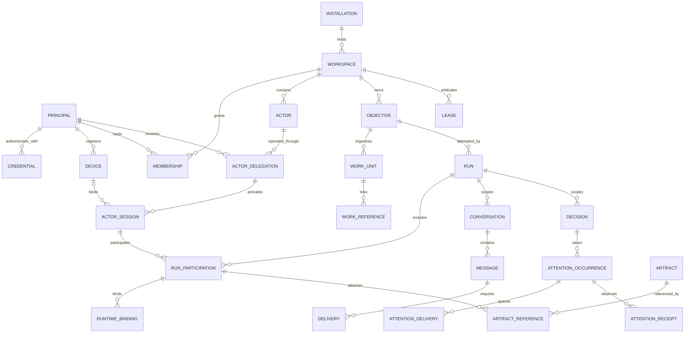

# Domain model

> **Authority:** Adopted language-neutral model; sidecar IDs and namespaces are independent  
> **Related:** [States](04-state-machines.md) · [Data](07-data-model.md) · [Operation registry](06-operation-registry.md)

## Identity hierarchy

Identity classes are never aliases even if a client displays the same name.

## Core entities

### Installation and authority

An **Installation** is one deployed authority boundary. It has a durable ID, home `AuthorityID`, current `storage_writer_generation`, schema/capability metadata and security admission state. It is not a filesystem path or process. Installation-scoped bootstrap/administration uses an installation admission epoch; workspace commands use only that Workspace's epoch. The two typed epoch scopes are never interchangeable.

### Workspace

A **Workspace** scopes policy, membership, actors, work, conversations, leases and integrations. A path or Git remote is a discovery locator only. Each workspace has exactly one opaque current writable `WorkspaceAuthorityEpoch`, rotated independently during promotion. All workspaces in one deployment additionally bind every write to the installation's current witnessed `storage_writer_generation`.

### Principal, device, credential and membership

- **Principal:** authenticated human, workload, service, or device-owning security subject.
- **Credential:** independently versioned proof reference with `active → rotated | revoked`; replacement creates a new Credential and rotation terminalizes the predecessor. `rotated` and `revoked` are terminal. It is never an actor.
- **Device:** registered client device with trust revision and bounded capability.
- **Membership:** principal's workspace capability ceiling and lifecycle.

### Actor, delegation and session

- **Actor:** durable author visible in work history: human persona, agent, automation or service persona.
- **ActorDelegation:** permission for one principal to operate one actor within membership/policy limits.
- **ActorSession:** bounded authenticated presence joining authority epoch, workspace, principal, actor, membership/delegation revisions, optional device, grants, absolute expiry and client instance.

Effective authorization is the intersection of current policy, authority admission, principal status, membership, delegation, device trust, grants, resource constraints and operation. A snapshot cannot survive later revocation unchecked.

### Objective, work unit and work reference

- **Objective:** desired outcome and acceptance criteria.
- **WorkUnit:** locally modeled responsibility under an objective.
- **WorkReference:** provenance-bearing projection to a tracker object. Provider fields remain provider-owned.
- **ProviderOperation:** durable pending child representing a requested provider mutation until a causally correlated observation confirms or a definitive refusal rejects it.
- **Formation:** optional immutable, versioned team shape; not live process topology.

### Run, participation and runtime binding

- **Run:** durable attempt to advance an objective/work unit.
- **RunParticipation:** independent actor/session responsibility and evidence lifecycle.
- **RuntimeBinding:** durable association intent/history between participation and one observed provider runtime identity.

A **RuntimeEndpointRegistration** is the durable pairing and capability boundary for a runtime provider. A binding identity is not a terminal. The runtime tuple is `(runtime_endpoint_id, server_incarnation, opaque_terminal_id)`. Reuse of the terminal value under a new incarnation is a different runtime identity.

### Context checkpoint

A **ContextCheckpoint** is an immutable, authorization-scoped projection built from one internally consistent canonical-state snapshot and event high-water. It records schema, digest, policy basis, through-cursor and continuations. It is reproducible/disposable and never grants command authority.

### Conversation, message and delivery

- **Conversation:** durable stream scoped to work, run, decision or explicit participants.
- **Message:** immutable authored content with causality and attachments.
- **Delivery:** per-recipient obligation and independent monotone availability/read/ack facts. To/Cc/Bcc visibility is snapshotted at send time.

### Decision and attention

- **Decision:** typed request for an authorized choice with responders, schema/options, deadline and source context.
- **AttentionOccurrence:** one unresolved need for recipient attention, causally linked to a source condition.
- **AttentionDelivery:** one channel/destination/generation obligation whose domain lifecycle ends at provider acceptance/cancellation. Retry/claim/park details belong to OutboxAttempt.
- **AttentionReceipt:** device/recipient observations such as shown, seen or dismissed.

Provider acceptance, shown, seen, dismissal and source resolution are not implications of each other.

### Lease and fence

A **Lease** is a time-bounded claim over canonical selectors (initially exact path or directory subtree), mode, holder and enforcement class. A **Fence** is the opaque set of `(authority_epoch, conflict_key, sequence)` entries assigned at grant. Lease correctness uses database authority time. Filesystem enforcement is advisory unless every protected mutation validates the fence.

### Artifact

An **Artifact** records declared digest, byte size, media type, storage identity, verification state, retention and authorization. Bytes live in content-addressed storage, not ordinary relational rows. References attach verified evidence to domain resources.

### Event, receipt, outbox and projection

- **DomainEvent:** immutable successful fact in a per-authority hash chain.
- **CommandReceipt:** semantic replay record keyed by command and scoped idempotency identity.
- **OutboxJob:** durable post-commit effect intent with stable logical identity.
- **Projection:** disposable read model with source stream, schema, high-water cursor and rebuild rules.

## Aggregate boundaries

| Aggregate | Owns | Does not own |
|---|---|---|
| Workspace | policy reference, lifecycle, authority scope | tracker graph, terminal inventory |
| Membership | workspace-principal capability lifecycle | actor authorship |
| ActorDelegation | principal↔actor authorization | session lifetime |
| ActorSession | immutable binding and terminal lifecycle | runtime process |
| Objective | desired outcome, acceptance revision and lifecycle | WorkUnit lifecycle or provider fields |
| WorkUnit | one native responsibility and references | Objective lifecycle or provider-owned state |
| WorkReference/ProviderOperation | observed provider provenance and pending operation child | provider truth or optimistic success |
| Formation | one immutable team-shape revision | live process/participation topology |
| Run | attempt lifecycle and acceptance snapshot | participation lifecycle details |
| RunParticipation | participant join/finish/evidence refs | run version except explicit semantic commits |
| RuntimeBinding | durable intent/observation lifecycle | terminal bytes/input authority |
| Conversation | scope and open/close policy | mutable message body |
| Message | immutable content, authorship and recipient snapshot | Delivery versions/facts |
| Delivery | one recipient obligation and monotone facts | Message content or other recipient state |
| Decision | response schema and terminal resolution | notification-provider lifecycle |
| AttentionOccurrence | source attention condition/generation | provider receipt semantics |
| Lease | claim lifecycle and fence | arbitrary filesystem mutation |
| Artifact | metadata/verification lifecycle | unbounded blob bytes |

## Universal invariants

1. Every persisted identity is a strongly typed UUIDv7; cross-kind reuse is invalid.
2. Versions begin at one, advance once per accepted aggregate mutation, and never exceed `2^53-1`.
3. One accepted command changes each declared aggregate at most once, even when emitting several events.
4. Rejected commands produce no success event or effect intent.
5. Exact replay creates no new version, event, audit success or outbox job.
6. Immutable messages/events/receipts/canonical hashes are never updated in place.
7. All cross-authority observations include provenance and observed version.
8. Secrets and terminal bytes are excluded from domain records and events.
9. Atomic semantic commit sets do not merge independently versioned aggregates: Objective/WorkUnit and Message/Delivery retain separate identity and contention boundaries.
10. Aggregate restoration validates the same invariants as live transitions; no `trusted=true` bypass exists.
11. Projections and ContextCheckpoints cannot authorize writes.
