# State machines

> **Authority:** Proposed experimental sidecar semantics adopted from the accepted target unless explicitly marked  
> **Related:** [Domain](03-domain-model.md) · [Use cases](05-use-cases.md) · [Failures](13-failure-recovery.md)

This page is exhaustive for core v1 lifecycle names. A transition not shown is forbidden and returns a typed state conflict without mutation. Expiry is an authority-time command, never a client-clock side effect.

## Authority and identity

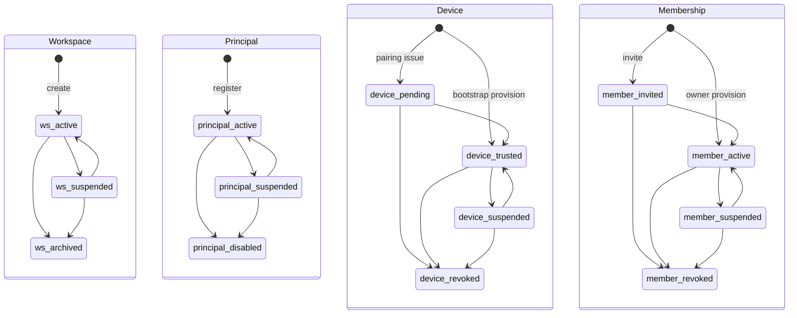

Bootstrap Device and owner Membership provisioning are explicit creation transitions producing exactly version 1 and one terminal creation fact for that aggregate; they do not perform two mutations at version 1. `archived`, `disabled`, and each typed `*_revoked` state are terminal. Suspension denies new work without erasing history. Capability/trust changes advance their own revisions and make existing sessions subject to current reauthorization.

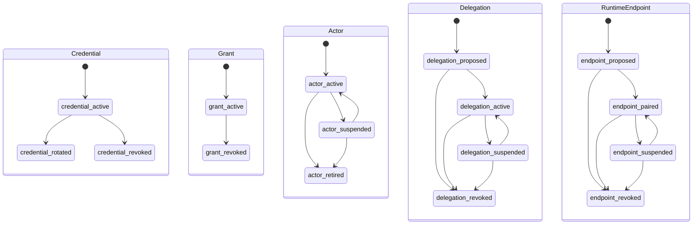

`credential_rotated`, every typed `*_revoked`, `actor_retired`, and `principal_disabled` are terminal. Credential rotation creates a new active Credential ID while terminalizing the predecessor in one declared commit set. Grant revocation never deletes historical authorization evidence. Only a paired endpoint may submit runtime observations.

## Actor session

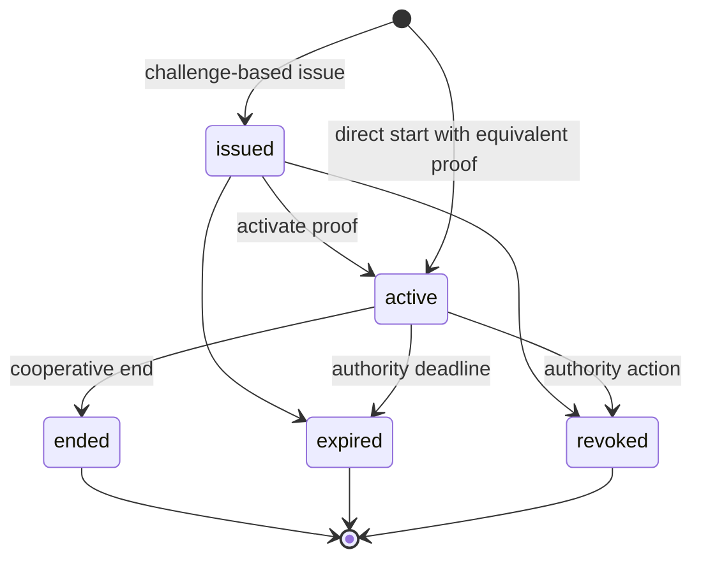

Transport `session.resume` reauthenticates a connection to a still-active domain session; it does not revive a terminal state. Connection/model/runtime loss does not end a session.

## Objective, work, provider operation and formation

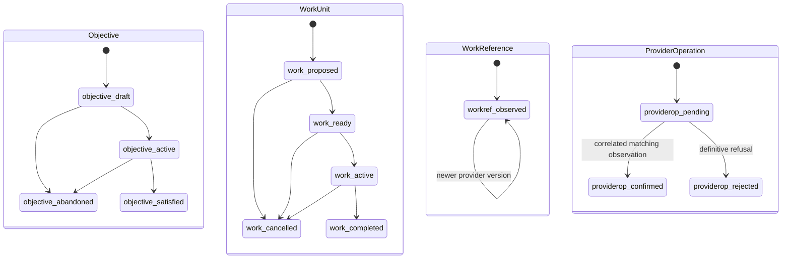

`satisfied`, `abandoned`, `completed`, `cancelled`, `confirmed`, and `rejected` are terminal. Formation definitions are immutable versioned revisions: defining or revising creates a new revision; it never mutates live process topology.

A matching provider value without operation causation is an independent observation, not proof that a pending operation caused it. Such a ProviderOperation remains pending; its associated OutboxAttempt may be `possibly_applied` until supported reconciliation resolves it.

## Run and participation

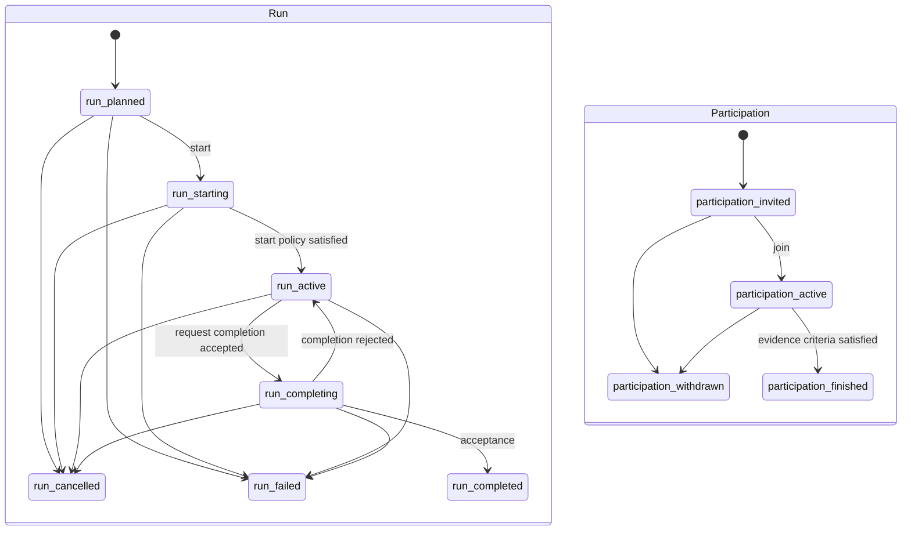

Run `completed/cancelled/failed` and Participation `finished/withdrawn` are terminal. Participations version independently. A live binding never activates or fails a Run implicitly.

**Implemented reference:** current canonical Go Run supports only `planned → starting`, Participation `invited → active`, and initial Binding `requested`. Later states are accepted targets requiring independent sidecar evidence.

## Runtime binding

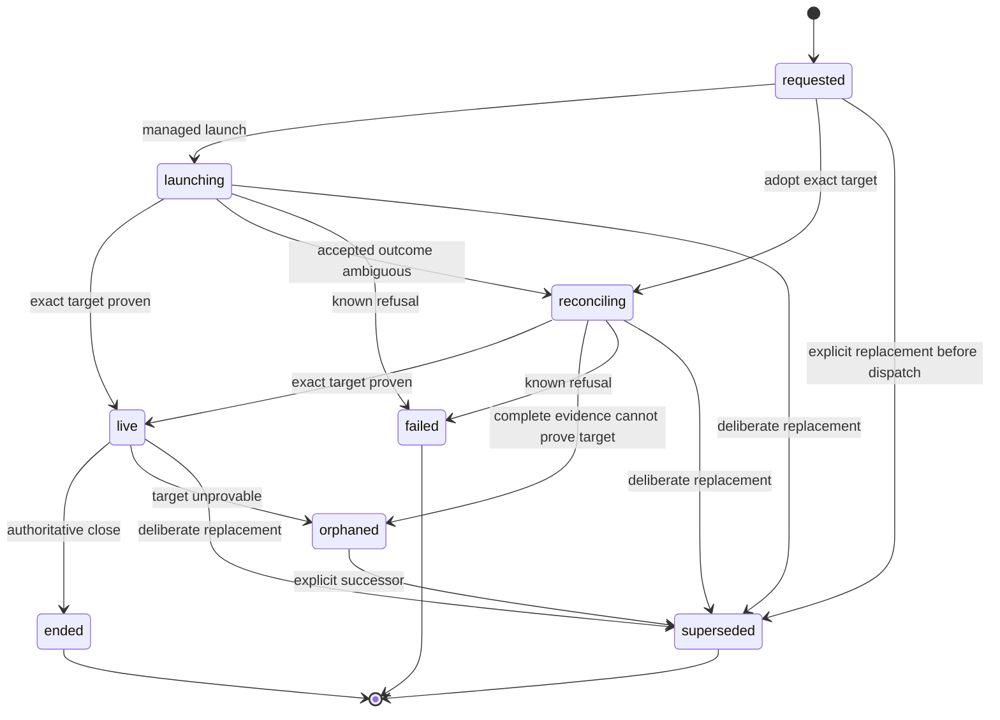

`ended`, `failed`, and `superseded` are terminal. An orphan cannot return live; recovery uses a new Binding ID. Watcher/UI/transport loss changes health only. Runtime identity is endpoint + server incarnation + opaque tagged terminal ID.

## Context checkpoint

A ContextCheckpoint is immutable after creation. It records authorization/policy basis, internally consistent source snapshot, through-cursor, schema/digest, continuations and expiry. Expiry/narrowing/compaction creates a new checkpoint; an old one is never edited or used as a grant.

## Conversation, message and delivery

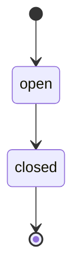

Message is immutable. Delivery is an independently versioned aggregate. Its dimensions form a monotone product rather than one lifecycle:

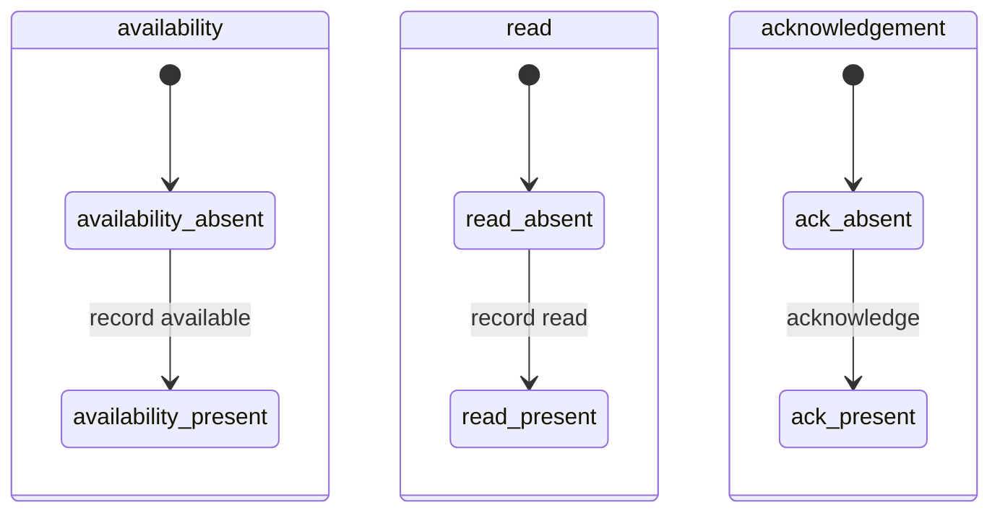

Any ordering is legal. Acknowledgement implies neither read nor availability and does not make Delivery terminal.

## Decision and attention

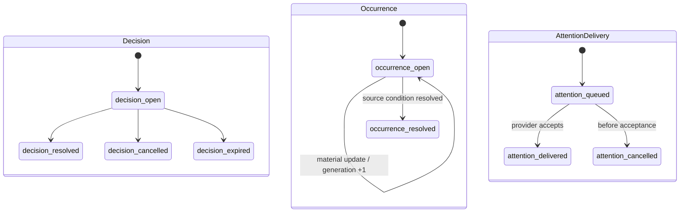

Decision `resolved/cancelled/expired`, Occurrence `resolved`, and Delivery `delivered/cancelled` are terminal. Provider claim/retry/park states belong to OutboxAttempt, not AttentionDelivery.

A Decision snapshots eligible responders and uses **first valid response wins** in v1. Resolution is one exact-version command; concurrent later responses are `DecisionTerminalConflict`. No response replacement or quorum exists in v1. Changing question/options/schema/responders/deadline creates a superseding Decision. Expiry and resolution serialize under exact version and authority time.

Attention shown/seen/dismissed facts form another independent monotone product keyed by occurrence, device, and generation. They do not resolve the source condition.

## Lease

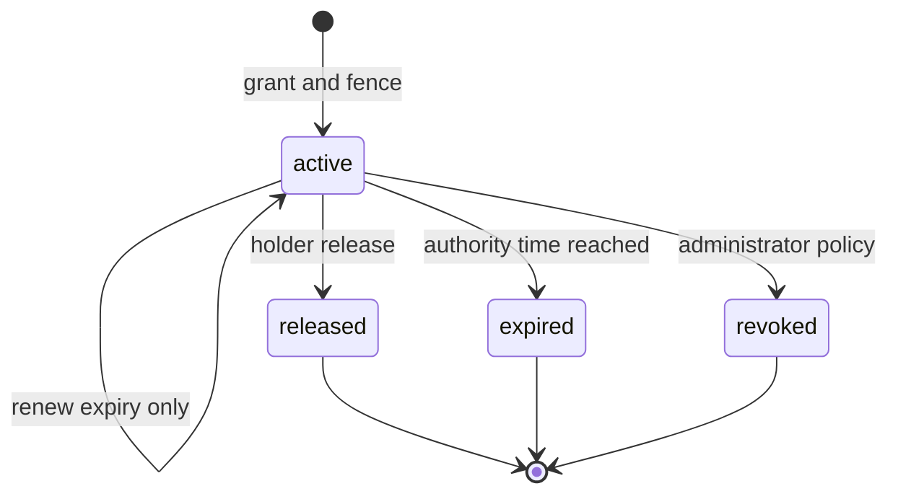

Renewal preserves the fence. Successor grants increment relevant conflict-key sequences. Acquisition decides expiry under lock; cleanup is not correctness-critical.

A remote `fence.validate` query alone is advisory because validity can change after response. An `integration_enforced`/`sidecar_enforced` mutation boundary MUST couple fence comparison and protected mutation using a provider-native conditional operation, transaction, or lease-token check at mutation time. Otherwise the enforcement class is `advisory`.

## Artifact

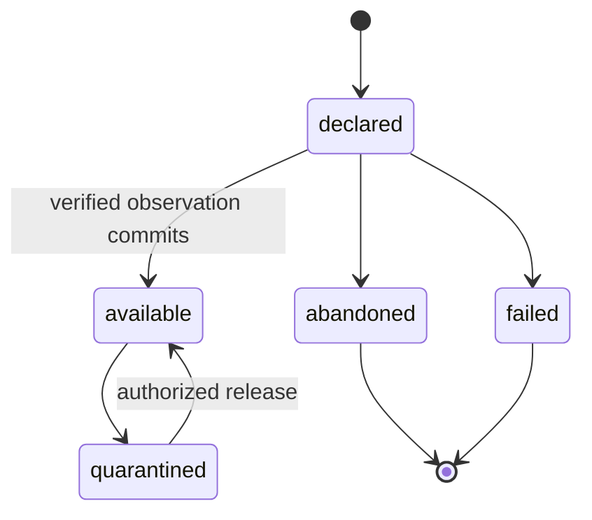

Staging and object publication are operational states, not readable Artifact states. Database availability occurs only in a later idempotent verification command after object existence/hash/size/media are proven. Object-published/DB-not-available windows are reconciled by staging manifest and digest.

## Outbox job and attempt

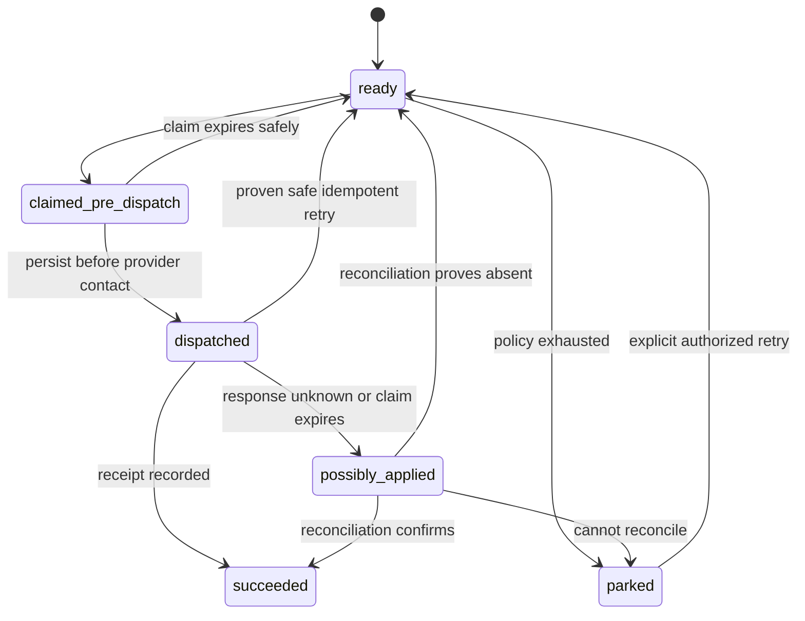

A previous dispatched attempt may still be running after claim expiry. It is never automatically overlapped for a non-idempotent provider. Claims renew boundedly; durable phase and stable effect identity govern recovery.

## Forbidden implications

- session credential refresh does not extend domain session lifetime;
- live runtime does not activate Run without `run.activate`;
- message ACK does not mark read;
- push/provider acceptance does not resolve attention;
- lease does not grant runtime input;
- run completion does not close tracker work;
- object upload/publication does not make Artifact available;
- provider timeout does not imply rejection;
- process death does not imply DB rollback or provider-effect absence.
