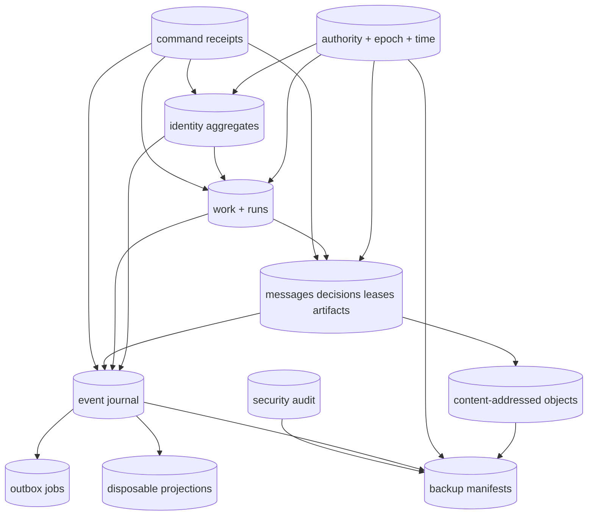

# Logical data model

> **Authority:** Experimental sidecar persistence model; table names are logical, not copied Blackbird SQL  
> **Related:** [Domain](03-domain-model.md) · [UoW](08-consistency-uow.md) · [Storage overlay](effect-v4/05-storage.md)

## Storage philosophy

Normalized current state is canonical. The immutable journal provides audit, cursor sync and projection input; it is not the sole source for reconstructing aggregate state. Outbox records make external effects durable. Projections are disposable.

SQLite and PostgreSQL may use different SQL, indexes and lock mechanisms but MUST implement identical domain command outcomes and constraints.

## Logical record groups

| Group | Logical records | Critical constraints |
|---|---|---|
| Authority | installations, workspaces, authority heads, epochs, time floors, admission generations | one current writer; epoch equality-only; persisted authority time monotone |
| Identity | principals, credentials, devices, memberships, actors, delegations, grants, actor sessions | typed UUIDv7; purpose/scope bindings; exact versions; terminal states immutable |
| Ceremonies | invitations, one-use challenges, global ceremony ledger, rejected attempts | global unique ceremony ID; pending→consumed once; proof secrets absent |
| Work | work references, provider-operation children, objectives, work units, formation revisions | provider provenance/version/causation; provider fields never locally authored |
| Runs | runs, participations, runtime endpoints, runtime bindings, binding observations, context-checkpoint metadata | independent versions; runtime tuple uniqueness under endpoint/incarnation; checkpoint basis cursor/digest |
| Coordination | conversations, messages, recipient snapshots, deliveries | message immutable; message+initial deliveries atomic; Bcc visibility constrained |
| Decisions | decisions, responses, attention occurrences, deliveries, receipts | one terminal decision; generation uniqueness; receipt facts independent |
| Leases | leases, normalized selectors, ancestor guard keys, conflict counters, fence entries | no overlapping exclusive active grants; sequence monotone per key/epoch |
| Artifacts | artifacts, uploads, object metadata, references, retention pins | digest/size verified before available; no partial readable object |
| Commands | receipts, scoped idempotency identities, receipt resources, recovery capsules | global command uniqueness; secondary partial uniqueness; immutable completed result |
| Journal | authority stream heads, domain events, stream digests | contiguous sequence; aggregate version+ordinal uniqueness; immutable hash chain |
| Security audit | audit heads, entries, denial dedupe/buckets | separate chain; bounded denial volume; no content/secrets |
| Outbox | jobs, attempts, claims, receipts, parked/reconciliation state | stable effect identity; claims fenced; external I/O after claim commit |
| Projections | registry, generations, high-water cursors, search/read tables | source declaration; atomic generation swap; never write authority |
| Backups | backup sessions, manifests, artifact roots, restore verification | schema/cursor/checksums/key metadata tied together; target fresh/sealed |
| Federation | peers, keys, proposals, accepted envelopes, authority transitions | future; signed audience/epoch/replay rules; no direct DB merge |

## Logical ER view

## Command atomic set

An ordinary accepted command transaction includes exactly the declared subset of:

1. aggregate rows and guard rows;
2. consumed/issued ceremony rows;
3. completed receipt and semantic result digest;
4. contiguous event records and stream head;
5. one required security audit success entry;
6. deterministic outbox intents;
7. immutable recovery-capsule draft when required.

If any constraint, codec, size, compare-and-swap, journal or audit check fails, all roll back.

## Key constraints

### Versions and references

Every mutable aggregate has `(id, version, state, authority_epoch, updated_authority_time)`. Mutations use `WHERE version = expected` plus current admission/authorization-generation predicates. References that affect a decision are guarded at exact observed version.

### Receipt identity

Two independent uniqueness classes:

- global `command_id`;
- exactly one closed secondary identity variant:
  - workspace command: `(workspace_id, principal_id, client_instance_id, operation_major, idempotency_key)`;
  - installation bootstrap: `(installation_id, approved_transcript_fingerprint, operation_major, idempotency_key)`;
  - authenticated installation administration: `(installation_id, principal_id, client_instance_id, operation_major, idempotency_key)`.

Requested authority ID/epoch, request ID, transport deadline/retry/route and response formatting are excluded from semantic identity/fingerprint so exact recovery works after authority rotation. Semantic scope, principal/actor attribution, expected versions and command body remain included.

Same identity/same fingerprint is a replay candidate subject to current disclosure authorization. Same identity/different fingerprint is conflict.

### Event identity

At minimum enforce uniqueness over:

- event ID;
- `(scope, epoch, sequence)`;
- `(command_id, event_ordinal)`;
- `(aggregate_kind, aggregate_id, aggregate_version, event_ordinal)`.

### Lease overlap

Canonical selectors are indexed as exact paths and terminal subtrees. Acquisition locks finite ancestor guard keys in sorted order, then checks actual overlap. It never enumerates files.

### Message privacy

Recipient role and visibility are immutable snapshots. Queries filter before pagination/counting. Bcc identities do not appear to unauthorized recipients, logs, event summaries or notification payloads.

## Field and key specification deliverable

This logical map does not authorize SQL implementation by itself. Before each roadmap stage, the sidecar operation registry MUST ship an engine-neutral record catalog with, for every logical record: field name and scalar schema, primary/foreign keys, nullability, defaults, ownership and delete/retention rule, mutable columns, version/CAS guards, unique/check constraints, indexes, authorization class, event/receipt linkage, and migration introduction version. Engine migrations are reviewed against that catalog and may add physical columns/indexes without changing semantics.

## Engine notes

| Concern | SQLite | PostgreSQL 18 |
|---|---|---|
| Writer model | one bounded daemon write lane; `BEGIN IMMEDIATE` | concurrent transactions with canonical row/advisory locks |
| Isolation | explicit single-writer semantics | READ COMMITTED + locks/CAS; SERIALIZABLE for predicate-sensitive catalog cases |
| Journal position | serialized stream head | locked stream head / sequence allocation |
| Queue claims | claim token/deadline under write lane | `FOR UPDATE SKIP LOCKED` |
| Wake | in-process hint plus durable polling | `LISTEN/NOTIFY` hint plus durable polling |
| Search | FTS5 | tsvector/GIN |
| Backup | online backup API + object manifest | physical/logical/PITR workflow + object manifest |
| JSON | canonical text/blob with strict decode | JSONB for open payloads only; canonical bytes stored where cryptographic |
| UUID | validated canonical text/blob | native UUID plus type mapping |

## Reference implementation coverage

This table prevents accidental claims about current Go maturity.

| Area | Blackbird reference coverage |
|---|---|
| W0 authority/identity/receipts/events/audit/outbox | Implemented for SQLite and PostgreSQL, verification still bounded |
| Work/objective/run plan/join/start | Canonical implementation exists; strict production ingress remains fail-closed |
| SQLite messages/deliveries/leases | Adjunct implementation exists |
| PostgreSQL messages/deliveries/leases | Unsupported in current reference |
| Full runtime-binding lifecycle | Accepted target; current canonical state is partial |
| Decisions/attention/artifacts/completion/search | Accepted target; not full production implementation |
| SQLite backup | Substantial implementation/tests |
| Hosted authority witness/failover/DR | Accepted target; not production-proven |

The sidecar starts with fresh migrations. It does not copy these tables or migrate live Blackbird rows.
