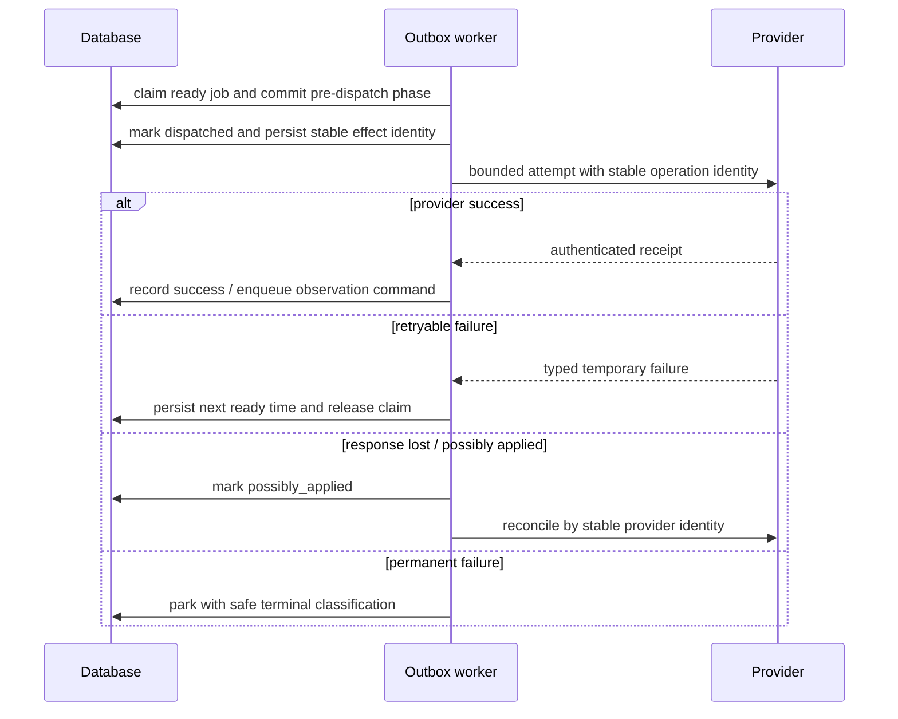

# Events, outbox, projections and subscriptions

> **Authority:** Core experimental sidecar durability design  
> **Related:** [UoW](08-consistency-uow.md) · [Failure/recovery](13-failure-recovery.md) · [Operations](14-operations-observability.md)

## Immutable journal

Every accepted domain transition writes typed events in the command transaction. Each authority scope/epoch owns a contiguous sequence and rolling digest chain.

An event envelope includes:

- event ID, schema/type/version;
- scope, authority ID and opaque epoch;
- internal stream sequence and event ordinal;
- aggregate kind/ID/resulting version;
- authority time;
- principal/actor session or service attribution;
- causation, correlation and command IDs;
- authorization digest;
- typed bounded payload;
- previous stream digest, event digest and resulting stream digest.

Event time never changes when delivery is retried. Provider attempt/receipt times are separate records.

## Journal invariants

- rejected/query operations emit no domain event;
- event sequences are gap-free within committed scope/epoch;
- multiple facts from one aggregate version use deterministic ordinals;
- hash inputs use typed JCS views and bounded integers;
- events are immutable and append-only;
- normalized current state is not rebuilt solely by replay;
- retained events must cover every registered projection's rebuild contract.

## Transactional outbox

An effect planner receives applied fact drafts and returns bounded intents:

```text
(command_id, handler_name, handler_contract_version,
 destination_key, effect_ordinal)
```

That tuple is unique and becomes the destination idempotency identity. A job stores causing event, ready time, attempts, claim token/epoch/deadline, outcome/retry class and bounded metadata. It never stores a closure or Effect value.

## Worker protocol



Delivery is at least once across external boundaries. Exactly-once applies only to a Sidecar domain transition. Claims renew for a bounded attempt. Claim expiry can auto-reclaim only pre-dispatch work or a provider operation with proven idempotency. A dispatched attempt may still be running; an expired/unknown non-idempotent attempt enters `possibly_applied` reconciliation and is never overlapped blindly.

Backoff policy may be calculated with Effect `Schedule`, but the chosen next-ready time and attempt state are persisted. Process restart loses no schedule authority.

## Wake signals versus durable sync

SSE, WebSocket, MCP resource-update and in-process notifications say only “the head may have advanced.” They may be lost, duplicated, reordered or coalesced. A client recovers through `events.sync` using an opaque scope-bound cursor.

A cursor encodes/authenticates scope and retained position but is opaque to clients. If invalid, scope-mismatched or expired, the server returns a typed error and instructs `context.get`. Applying checkpoint plus later deltas must converge to the same normalized context as uninterrupted sync.

Slow subscribers have bounded queues (initially 1 MiB and 1,024 events). At the limit the stream closes with a resumable cursor; durable events are not dropped to preserve a socket.

## Projection registry

Every disposable projection registers:

- name and schema version;
- source authority stream(s) and minimum retained event versions;
- accepted event types/versions/upcasters;
- deterministic reducer;
- high-water cursor/digest;
- rebuild/swap policy;
- equivalence verifier;
- authorization filter boundary.

### Rebuild

A rebuild begins with an engine-supported consistent canonical-state snapshot. The same snapshot transaction records the authority scope/epoch, projection schema, canonical snapshot digest and a journal **basis cursor** at or after every reflected state change. Snapshot rows are streamed from that fixed view; later journal events are consumed strictly after the basis cursor. Retention pins the basis through swap or abort.

1. create empty shadow generation;
2. acquire and record the consistent canonical snapshot plus basis cursor/digest;
3. reduce the fixed snapshot deterministically;
4. reject gaps/unsupported known versions while catching up strictly after basis;
5. catch up to chosen high-water;
6. verify invariants and normalized hashes against the declared source contract;
7. atomically swap generation pointer;
8. retain old generation until rollback window passes.

Duplicate/reordered supported inputs converge; omitted input prevents high-water advancement and swap. Projection rebuild does not edit aggregate state or journal.

## Standard projections

- session context checkpoint/deltas;
- inbox/thread and independent delivery facts;
- run joined view with binding health/history;
- participant and actor presence summaries;
- WorkReference freshness/provenance;
- decision/attention views;
- lease conflict and enforcement indicators;
- artifact metadata/evidence;
- authorized full-text search;
- operational outbox/backlog/dead-letter views.

Search results are projection output. SQLite FTS5 and PostgreSQL full-text/GIN implement one stable result contract and must apply authorization before result disclosure.

## OpenCode-style push reference

The implemented Blackbird plugin demonstrates the right pattern:

1. durable catch-up pages;
2. visibility-checked message fetch;
3. deterministic downstream prompt ID;
4. persist cursor/deduplication only after downstream acceptance;
5. SSE used only to wake another catch-up;
6. never mark read/ack on behalf of the agent.

The sidecar may adopt the pattern under independent contracts/credentials, not the Blackbird local endpoint.

## Dead letters and operator action

“Dead letter” means a parked, inspectable job, not discarded data. Operator action can:

- retry with the same effect identity;
- reconcile a possibly applied operation;
- cancel an obsolete delivery due to source resolution;
- quarantine a poison payload and open an incident;
- change provider routing by a new authorized command.

Operators cannot edit a job into success or synthesize provider/domain facts.
