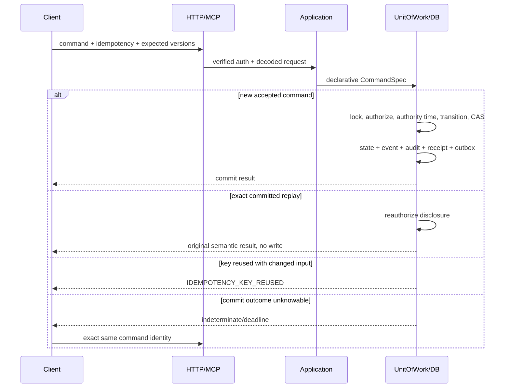
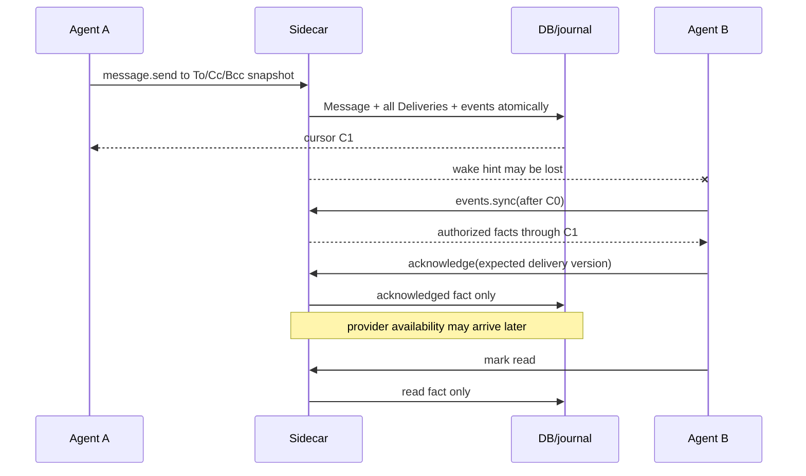
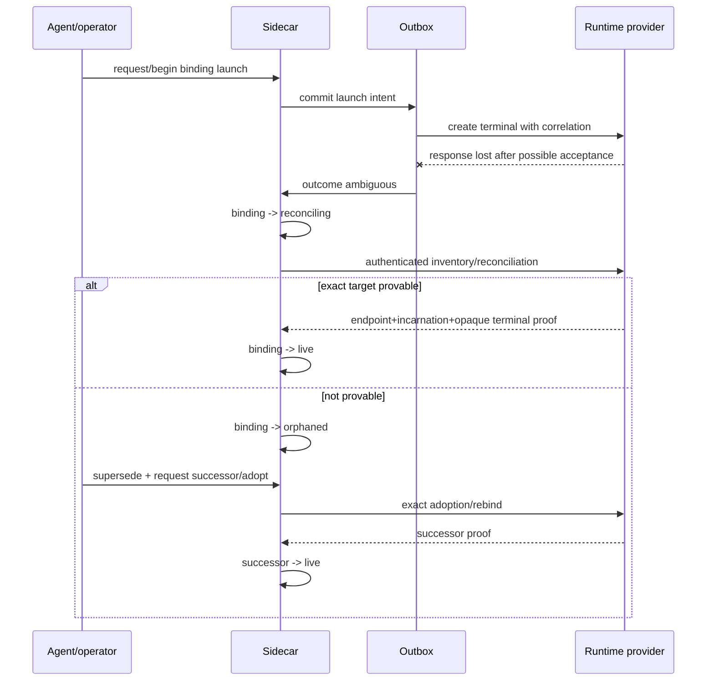
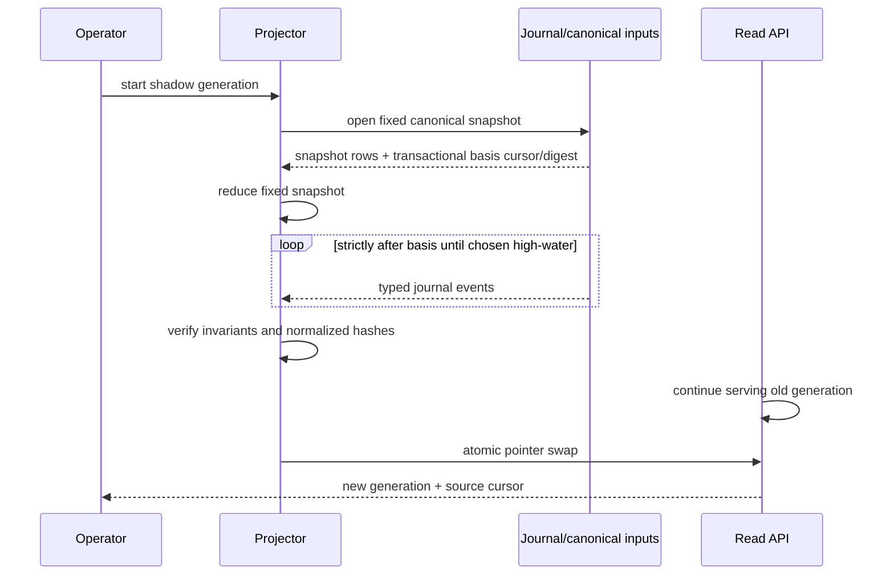

# End-to-end sequence diagrams

> **Authority:** Normative flow map when paired with each command's catalog entry  
> **Related:** [Use cases](05-use-cases.md) · [UoW](08-consistency-uow.md) · [Recovery](13-failure-recovery.md)

## Fresh bootstrap to session

```mermaid
sequenceDiagram
  actor H as Human
  participant C as Client/device
  participant S as Sidecar
  participant DB as DB
  H->>C: approve bootstrap and device key
  C->>S: installation.bootstrap + invitation proof
  S->>DB: atomic invitation consume + Principal + Device + owner Grant + events/receipt
  DB-->>S: known commit
  S-->>C: resources + cursor + recovery capsule
  C->>S: workspace.create
  S->>DB: Workspace + owner Membership atomically
  C->>S: actor.create; delegation.propose/activate
  C->>S: session.start with distinct handoff
  S->>DB: active ActorSession + event/receipt
  S-->>C: session-bound context capability
```

Each ceremony has a distinct ID, purpose, proof and one-use guard. Response loss is recovered by exact command replay.

## Command transaction and replay



## Run lifecycle and provider transition

```mermaid
sequenceDiagram
  participant O as Operator
  participant A as Agent A
  participant B as Agent B
  participant S as Sidecar
  participant R as Runtime provider
  participant T as Tracker
  O->>S: run.plan_with_bindings
  S->>S: Run + Participations + requested Bindings atomically
  A->>S: participation.join
  B->>S: participation.join
  O->>S: run.start
  S->>R: post-commit launch effects
  R-->>S: authenticated live observations
  O->>S: run.activate under start policy
  A->>S: verify/attach evidence; participation.finish
  B->>S: verify/attach evidence; participation.finish
  O->>S: run.completion.request with exact snapshot
  O->>S: run.completion.accept
  O->>S: provider.transition.request
  S->>T: stable provider operation
  T-->>S: causally correlated newer provider observation
  S->>S: pending operation -> confirmed
```

## Message, sync and independent facts



## Lease conflict and fence

```mermaid
sequenceDiagram
  participant B as Holder B
  participant S as Sidecar
  participant DB as DB
  participant A as Agent A
  participant G as Cooperating guard
  B->>S: acquire subtree src/proof exclusive
  S->>DB: lock ancestor keys; expire/check overlap; grant fence
  DB-->>B: epoch + conflict-key sequences
  A->>S: acquire exact src/proof/file.ts
  S->>DB: overlap check under same guards
  DB-->>A: LEASE_CONFLICT without holder fence
  G->>S: validate stale fence
  S-->>G: FENCE_REJECTED; no mutation
  G->>S: request protected mutation with exact fence
  S->>G: invoke provider-native conditional mutation
  G->>G: compare current fence and mutate atomically / no-follow
  G-->>S: accepted or stale-fence rejection
```

## Ambiguous runtime launch and rebind



## Decision and mobile attention

```mermaid
sequenceDiagram
  participant B as Requester
  participant S as Sidecar
  participant N as Notification provider
  participant M as Mobile
  B->>S: decision.request
  S->>S: Decision + Occurrence + generation-1 Delivery atomically
  S->>N: outbox attempt
  N--xS: offline/retry
  N-->>S: provider accepted later
  S->>S: delivery accepted fact
  N-->>M: minimal notification
  M->>S: authenticate; decision.get
  M->>S: decision.resolve(expected version)
  S->>S: DecisionResolved commit
  S->>S: source-condition worker resolves Occurrence separately
  S-->>B: wake; B syncs both facts
```

## Artifact finalization

```mermaid
sequenceDiagram
  participant A as Participant
  participant S as Sidecar
  participant O as Object store
  participant V as Verifier
  A->>S: artifact.declare(hash,size,media)
  S-->>A: bounded staging capability
  A->>O: streamed upload
  A->>S: artifact.verification.request
  S->>V: post-command verification effect
  V->>O: hash/size/media/availability check
  V->>S: artifact.verification.observe (authenticated)
  alt exact match
    S->>S: Artifact -> available
    A->>S: artifact.attach
  else mismatch/cancel/quota
    S->>S: Artifact -> failed/abandoned; no readable object
  end
```

## Outbox crash windows

```mermaid
sequenceDiagram
  participant W as Worker
  participant DB as DB
  participant P as Provider
  W->>DB: claim pre-dispatch and commit
  W->>DB: persist dispatched + stable effect identity
  W->>P: contact with stable effect identity
  P-->>W: accepted
  Note over W: crash before recording
  W->>DB: claim expires; next worker sees uncertain attempt
  alt provider supports idempotent replay
    W->>P: same identity
  else non-idempotent/unknown
    W->>DB: possibly_applied
    W->>P: reconcile
  end
  W->>DB: record outcome once
```

## Projection rebuild



## Backup, restore and epoch rotation

```mermaid
sequenceDiagram
  participant O as Operator
  participant S as Source daemon
  participant B as Backup store
  participant R as Restore verifier
  participant W as Authority witness
  O->>S: online backup
  S->>B: DB snapshot + journal cursor + artifact/key manifest
  B-->>O: checksummed manifest
  O->>R: restore into fresh sealed target
  R->>R: schema, integrity, events, projections, objects, keys
  R->>W: request writable promotion with predecessor evidence
  W-->>R: fenced authorization / new random epoch
  R->>R: invalidate old fences/claims; enable writes
  R-->>O: readiness only after reconciliation policy
```

## Offline import from Blackbird export

```mermaid
sequenceDiagram
  participant B as Blackbird export tool
  participant X as Signed offline export
  participant I as Sidecar importer
  participant S as Fresh sidecar workspace
  B->>X: public export; source remains stopped/unchanged
  I->>X: verify schema, signature, digests, provenance
  I->>I: reject credentials/sessions/active leases/runtime authority
  I->>S: deterministic new sidecar IDs + source references
  I->>S: import receipt and audit
  I->>S: replay same export
  S-->>I: same semantic import result, no duplicates
```
