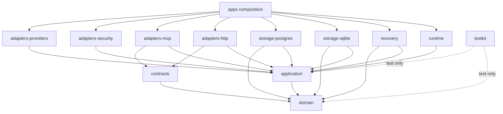

# Package architecture

> **Authority:** Experimental sidecar dependency decision  
> **Related:** [Neutral boundaries](../02-context-authority.md) · [Services](03-services-layers-runtime.md)

## Workspace layout

```text
apps/
  sidecar-daemon/       composition root and process entry
  sidecar-cli/          online admin client and exclusive maintenance entry
packages/
  domain/               typed IDs, values, states, pure transitions
  contracts/            Effect Schemas, wire DTO mapping, generated artifacts
  application/          commands, queries, authorization, UoW/provider ports
  storage-sqlite/       worker-owned SQLite adapter and migrations
  storage-postgres/     PostgreSQL adapter and migrations
  adapters-http/        product/admin HTTP
  adapters-mcp/         curated MCP
  adapters-security/    auth, proof, vault and signer ports
  adapters-providers/   runtime/tracker/notification/object store
  runtime/              supervision, config, health, shutdown
  recovery/             backup/restore verification, witness and authority promotion
  testkit/              models, fixtures, fault controls, conformance
```

Create fewer packages if no dependency boundary exists; never mirror every noun. Storage engines remain separate because their locking, backup and operational semantics differ.

## Dependency graph



## Boundary rules

### Domain

May import only language-standard, audited pure utilities explicitly approved by ADR. Initial posture is plain TypeScript, no Effect dependency. Exposes immutable values, constructors, transitions and decisions. No environment/global reads.

### Contracts

Owns Effect Schema boundary types and maps to/from domain values. Generates JSON Schema/OpenAPI/MCP fixture inputs. It does not own domain lifecycle or SQL rows.

### Application

Owns use-case orchestration, ports, authorization decision shapes, command registry and declarative UoW. May use Effect to sequence pre/post-transaction work, but pure decision is plain synchronous data.

### Storage/adapters

Implement application ports. Row/SDK/provider values are decoded and mapped at the boundary. Concrete exceptions never leak past adapter error mapping.

### Runtime/composition

Only composition roots construct concrete Layers, parse process config, install signal handling or choose SQLite/PostgreSQL/providers.

## Enforcement

Use all of:

- TypeScript project references with `composite` and explicit dependencies;
- package `exports` exposing public entrypoints only;
- no path aliases that bypass package boundaries;
- ESLint restricted-import rules;
- dependency-cruiser or equivalent architecture graph test;
- test that deliberately introduces each forbidden edge and proves CI fails;
- circular dependency detection;
- production bundle inspection proving testkit/fault controls absent.

## Naming and public API

Packages use an independent scope such as `@effect-sidecar/*` after owner approval. Wire schema names use `sidecar.*`. Do not publish packages named Blackbird or reuse `blackbird_*` tools.

## Generated code

Generated OpenAPI clients/manifests live in clearly marked subtrees and are reproducible. Handwritten code imports a narrow generated boundary, not generated internals. Generation drift is checked; generated output never becomes the source for domain semantics.

## Configuration

Config is decoded once at composition through typed Schema, including file/environment/CLI providers selected by product policy. Domain/application receive values/services, not `process.env`. Secrets are references or scoped secret values with redacted inspection.

## Testkit boundary

Fault injection, deterministic IDs, model transitions, fake providers, TestClock Layers and recording UoWs are exported only from `testkit` and excluded from production exports/bundles. Production constructors install real canonical/hash verifiers; callers cannot inject permissive verifiers through public API.
