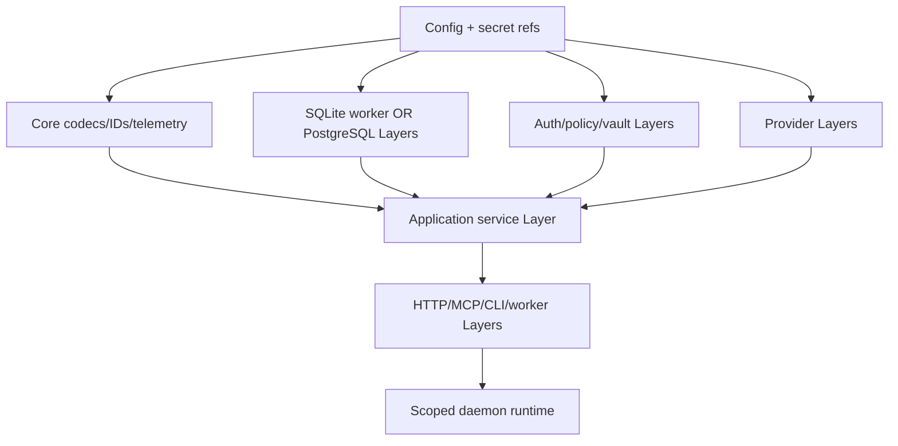

# Effect services, Layers and runtime lifecycle

> **Authority:** Experimental Effect implementation decision  
> **Related:** [Package graph](02-package-architecture.md) · [Storage](05-storage.md) · [Neutral UoW](../08-consistency-uow.md)

## Service inventory

| Service | Responsibility |
|---|---|
| `IdSource` | cryptographic UUIDv7/preallocated IDs outside transaction |
| `CanonicalCodec` | typed JCS/hash/signature vectors |
| `Authenticator` | verify channel/proof into immutable evidence |
| `PolicyEvaluator` | prepare/evaluate bounded current policy inputs |
| `SecretStore` | scoped key/credential operations and references |
| `RecoveryCapsuleSigner` | readiness + post-commit signing |
| `UnitOfWork` | declarative command/security transaction execution |
| `QueryStore` | authorized canonical/projection reads |
| `MigrationStore` | exclusive migration/manifest verification |
| `JournalStore` | cursor sync and internal verification |
| `OutboxStore` | claims, schedules, outcomes and reconciliation |
| `ProjectionStore` | registry, shadow generations and atomic swap |
| `ArtifactStore` | bounded staging/finalization/object verification |
| `RuntimeProvider` | Phux-style launch/inventory/adoption observations |
| `WorkProvider` | tracker observe/transition/reconcile |
| `NotificationProvider` | delivery attempts only |
| `CursorCodec` | opaque authenticated cursor encode/decode |
| `Telemetry` | redacted logs/metrics/traces/audit linkage |
| `HealthRegistry` | role-aware readiness/degradation |
| `BackupCoordinator` | pin consistent DB/artifact/key manifest and online backup |
| `RestoreVerifier` | sealed-target integrity, manifest and recovery-point verification |
| `AuthorityWitness` | exclusive writer-generation CAS, predecessor/storage fencing evidence |
| `AuthorityPromotion` | workspace recovery-pending gates, successor epochs and provider admission |

## Layer construction



Build exactly one Layer graph per Node isolate under one root Scope. The SQLite worker isolate has its own composition root and verified domain-decider bundle; it does not inherit main-thread services. Do not independently `provide` duplicate live graphs or allocate pools, workers, clients or policy graphs per request. Tests replace Layers at composition boundaries.

## Context discipline

Authenticated caller, authority scope, actor session, correlation and deadline are explicit immutable command/query inputs. A `FiberRef` MAY carry non-authoritative trace/log context but MUST NOT be the only holder of identity, authorization, transaction, idempotency or authority epoch.

## Resource ownership

Nested scopes form this ownership tree: root process → storage/security/telemetry; listener → request; background role → job/attempt; request → upload stream; and process → commit-outcome set. The root `Scope` ultimately owns:

- HTTP/MCP listeners and request scopes;
- DB pools and SQLite worker isolate;
- outbox/projector job scopes;
- provider clients/subprocesses and attempt scopes;
- subscriptions and queues;
- upload streams/files;
- process-owned commit-outcome fibers;
- telemetry exporters and secret handles.

Every acquisition has bounded release. Release failure is logged/observed and cannot mutate an already committed domain outcome.

## Fiber supervision

- no unscoped `fork`/fire-and-forget;
- daemon background fibers are scoped/parent-owned under one named hierarchy; supervisors observe them but do not provide lifetime ownership;
- per-handler concurrency uses bounded semaphores/queues;
- provider defects do not kill unrelated handlers, but critical storage/integrity defects fail readiness/process according to policy;
- fiber failures are joined/observed and classified;
- shutdown interrupts only at safe points and waits boundedly.

## Error taxonomy

Expected failures stay typed:

- domain rejection;
- authentication/authorization;
- database transient/indeterminate/integrity;
- dependency retryable/permanent/possibly-applied;
- cancellation/deadline;
- backpressure/cursor;
- configuration/readiness.

Programmer bugs, impossible tagged values, undeclared UoW access, invalid production verifier and codec/hash mismatch are defects. Catch defects only to release resources/rollback, then propagate and alert; never map them to ordinary state conflict.

## Interruption and commit

Application preparation/provider work is interruptible where safe. A DB adapter exposes one scoped operation whose commit-finalization region masks interruption long enough to learn commit outcome. Request cancellation does not force a false rollback result after commit began.

The pure transition is not Effectful:

```ts
// schematic, not wire API
type Decide = (snapshot: LockedSnapshot) => Apply | Replay | Reject
```

The UoW adapter invokes it synchronously while holding bounded locks, validates output and commits. Once the adapter enters commit, outcome determination transfers to a bounded process-owned completion fiber. Caller interruption stops response waiting but cannot interrupt that fiber. Driver/database timeouts bound it; inability to prove commit or rollback returns/persists an `indeterminate` posture resolved by exact receipt recovery.

## Time

- `Clock`/`TestClock`: retry delays, heartbeats, test scheduling and elapsed operational time.
- `AuthorityClock`: database wall time + persisted floor under locks for domain expiry/scheduling.

Never derive lease expiry, session terminal state, receipt accepted time or authority deadline from Effect Clock in production or tests.

## Queues and backpressure

Every Queue/Stream has an explicit element/byte bound and overflow policy. Durable events are never stored solely in a Queue. On subscription overflow, close with cursor. On SQLite worker queue saturation, reject/overload before unbounded memory; admitted commands retain exact retry semantics.

## Runtime lifecycle

The top-level scoped program:

1. loads/validates config and manifests;
2. constructs core/security and acquires the storage owner (the SQLite database worker first in local mode);
3. through that owner opens/verifies/migrates/recovers storage and registers health;
4. starts supervised outbox/projector job fibers;
5. starts listeners and signals ready;
6. awaits shutdown/fatal defect;
7. performs ordered drain described in [operations](../14-operations-observability.md).

Tests assert zero active handles/fibers after Scope closes.
