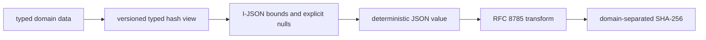

# Effect Schema and canonical codecs

> **Authority:** Experimental Effect boundary decision  
> **Related:** [Neutral contracts](../06-contracts.md) · [Package architecture](02-package-architecture.md)

## Raw JSON ingress

Every JSON ingress (HTTP/MCP/worker/provider/import) uses a bounded raw UTF-8 parser before Effect Schema. It rejects duplicate **decoded** property names, invalid UTF-8/surrogates, excessive depth/key/count/bytes and non-I-JSON numeric tokens before ordinary object construction can collapse evidence. Framework-parsed bodies are forbidden for signed/fingerprinted inputs unless the framework exposes and this parser validates the original bytes.

## Schema roles

Effect Schema defines executable decoders/encoders for:

- transport commands/results/problems;
- provider observations/capabilities;
- SQL row values;
- worker RPC;
- configuration and manifests;
- export/import records;
- public event/projection contracts.

It does not define domain policy merely because a validation is expressible in Schema. Cross-field lifecycle decisions remain domain transitions.

## Scalar library

Create one reviewed module for:

- branded UUIDv7 per identity kind;
- operation/schema names and bounded opaque tokens;
- canonical integer `0..2^53-1`, positive version `1..2^53-1`;
- exact canonical six-digit UTC timestamp and a separate permissive input-normalization decoder where allowed;
- lowercase 64-character SHA-256;
- unpadded base64url;
- bounded UTF-8 text/byte counts;
- I-JSON values with depth/key/size limits;
- normalized workspace-relative paths/selectors;
- explicit nullable hash-view fields.

The existing Effect client spike's positive integer check lacks the required maximum and is not reusable without strengthening.

## Unknown-field/version policy

- command/provider/config/worker requests use reviewed exact-struct decode options/combinators pinned by kickoff compile probes and reject excess fields recursively, including union members; generated JSON Schema/OpenAPI `additionalProperties` rules MUST match runtime behavior at every nested object;
- public responses: permit additive optional fields but validate all known mandatory fields;
- known event type + unknown schema version: fail closed and stop affected projection;
- unknown event type: decode to inert bounded `UnknownEvent` retaining raw canonical bytes/digest; never apply to a reducer;
- SQL row unknown enum/state/version: integrity failure, not coercion/default;
- import unknown critical record: reject bundle; explicitly optional extension records may be retained inert.

## Domain mapping

Contracts decode from `unknown` into wire DTO values, then map through domain constructors. Row schemas decode driver output and call rehydration constructors. Domain values map to typed hash/event/result views before encoding.

Never persist or expose:

- `Option` encodings;
- `Duration` objects;
- `Cause`/Exit/fiber IDs;
- class prototypes or tagged error instances;
- JavaScript `Date`/BigInt/Map/Set/Symbol;
- SDK request/response objects;
- database driver row objects.

## Canonical JCS pipeline

Requirements:

- independent RFC 8785 implementation/package pinned after review;
- official and Blackbird/sidecar golden vectors;
- differential corpus against an independent language;
- output validation and canonicalization idempotence;
- duplicate decoded keys, invalid Unicode/surrogates, non-finite numbers, integers outside the safe range and excess bounds rejected;
- `JSON.stringify` alone forbidden.

## Timestamp policy

Transport may accept a documented RFC 3339 offset timestamp only when the operation permits normalization. Before fingerprint/hash/persistence, convert losslessly to UTC `YYYY-MM-DDTHH:mm:ss.ffffffZ`; any non-zero precision beyond microseconds is rejected, never rounded. Canonical domain numerics are safe integers only. Values requiring exact fractions/decimals use versioned strings or scaled integers. Provider/public JCS extension values may use finite IEEE-754 doubles only when their schema explicitly says so and cross-language shortest-round-trip vectors pass.

## Generated artifacts

Generate deterministically:

- product OpenAPI 3.1;
- admin OpenAPI 3.1;
- JSON Schema 2020-12 bundle;
- curated MCP tool/resource schemas;
- provider and worker fixtures;
- TypeScript SDK wire client.

Commit artifacts only if project policy chooses; CI always regenerates and checks digest. Handwritten wrappers provide Effect errors, interruption, pagination and domain mapping.

## Schema evolution

Each persisted/public schema has literal name and major. Additive fields define default/absence semantics. Breaking changes get a new schema/operation major plus migration/upcaster and compatibility window. Upcasters are deterministic pure functions with golden old-version fixtures.

No migration rewrites historical event meaning silently. A projection registry declares supported event versions and refuses swap when unsupported input exists.

## Sensitive values

Use redacted secret wrappers for in-memory display/logging. Even redacted wrappers are forbidden in domain events/receipts. Schema parse errors return bounded field/code information and never echo credential/content input.

## Codec verification checklist

- canonical max/min/overflow;
- UUID version/variant/case/cross-kind misuse;
- exact timestamp and offset normalization;
- JCS number/string/object vectors;
- explicit null versus omitted hash fields;
- duplicate keys/Unicode/depth/size;
- unknown fields/event type/version;
- round-trip through both SQL engines;
- cross-language digest/signature equality;
- no secrets in parse errors.
