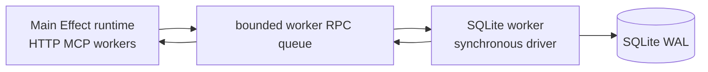

# Effect storage implementation

> **Authority:** Experimental implementation decision  
> **Related:** [Neutral data](../07-data-model.md) · [UoW](../08-consistency-uow.md) · [Runtime](03-services-layers-runtime.md)

## Why two explicit adapters

SQLite is a single-daemon local authority; PostgreSQL is a concurrent hosted authority. Sharing semantic fixtures does not justify hiding differences in locking, claims, search, backup, migrations or failure classification. Both implement the same application ports with engine-native SQL.

No ORM owns domain semantics. Effect SQL may provide connection/query/resource composition; aggregate mapping, locks and transaction algorithms remain explicit.

## SQLite worker architecture

`@effect/sql-sqlite-node` uses synchronous `node:sqlite`; busy waiting can block the Node event loop. Therefore a dedicated supervised worker thread exclusively owns:

- database connection(s) and write lane;
- migration and engine verification;
- `UnitOfWork` transaction execution;
- canonical queries/read snapshots (or proven bounded read connections);
- event sync and outbox claim SQL;
- checkpoints, integrity checks and online backup.

The main thread never opens the SQLite file.

## Worker RPC

Messages are versioned Effect Schemas with request ID, `operation_major`, bounded deadline/cancellation token, immutable command/query spec and expected response union. A bounded main-thread dispatcher first validates/encodes to a transferable byte buffer, enforces message/depth limits, and atomically reserves queue count+byte capacity; only admitted buffers reach `postMessage`. No functions, Effects, Errors, secrets or arbitrary structured-clone objects cross.

### Semantics

- bounded queue count and encoded bytes;
- admission rejection before unbounded allocation;
- worker linearizes admitted writes through states `admitted → begun → precommit → committing → terminal`;
- cancellation before `begun` yields `cancelled_before_begin`; cancellation before commit after begin rolls back and yields `rolled_back`;
- once `committing` starts, worker finishes bounded outcome determination independent of caller cancellation and yields `committed` or `indeterminate`;
- every terminal reply includes authoritative worker request state and receipt identity;
- response channel loss does not change DB result; caller resolves via receipt;
- worker death makes every admitted nonterminal write `indeterminate` unless recovery proves it never began or rolled back;
- supervisor restarts only after SQLite recovery/integrity/readiness checks;
- request IDs do not replace command/idempotency IDs.

## SQLite configuration

At startup verify runtime SQLite version/source ID/compile options and supported filesystem. Apply and verify:

- WAL mode;
- foreign keys on;
- `synchronous=FULL` (and platform full-fsync settings where supported/proven);
- `trusted_schema=OFF`;
- bounded busy timeout;
- application ID/user version/migration checksum manifest;
- private file/directory permissions;
- one serialized command lane.

Use `BEGIN IMMEDIATE` for authoritative writes. Keep transactions short; no external I/O or main-thread callback occurs while open. A bounded read pool is optional only after snapshot, worker-contention and backup evidence.

Online backup uses the runtime's supported SQLite backup API through a reviewed narrow primitive when Effect SQL lacks it. Raw copying a live WAL set is forbidden.

## PostgreSQL 18

Use async `@effect/sql-pg` with exact compatible package/`pg` versions. Decode every row from unknown and map driver failures into typed storage classes.

### Transactions

- default READ COMMITTED only where each registry invariant names a concrete unique/exclusion constraint, locked guard row, transaction-scoped `pg_advisory_xact_lock`, or other proven mechanism;
- SERIALIZABLE for cataloged predicate/absence invariants without a stronger explicit mechanism;
- every operation entry declares canonical lock keys/order; missing-row and empty-range checks are never protected by CAS alone;
- bounded whole-UoW retries for deadlock/serialization;
- acquire, statement, lock and idle-transaction timeouts;
- commit outcome ambiguity preserved;
- no shared transaction/client across concurrent fibers.

### Outbox

Claim with `FOR UPDATE SKIP LOCKED`, persist claim before external effect, and fence claims by authority/worker epoch/token/deadline. `LISTEN/NOTIFY` only wakes polling.

### Roles

Separate least-privilege migration, API, worker/projection, backup and observability DB roles. TLS and credential rotation are required. Hosted HA is unsupported until a concrete witness and stale-writer fault suite pass.

## Migrations

Engine-specific immutable SQL files have ordered version, checksum, minimum engine capability and application contract version. Migration ownership is exclusive. Startup accepts only:

- old schema with a supported forward path;
- exact current schema/manifest;
- explicitly resumable interrupted state defined by that migration.

No down migrations over user data. Never auto-repair unknown checksum/drift. Test empty install, every previous release, interrupted migration, disk/connection failure, backup-before-upgrade and old-binary behavior.

## UoW mapping

The adapter receives declarative `CommandSpec` containing `operation_major`. PostgreSQL may receive a direct synchronous decider from the same verified registry. SQLite never receives a callback: before transaction open, the worker resolves `operation_major` through a closed worker-local decider registry, rejects unknown/disabled entries, and verifies its registry/domain bundle digest against the main artifact manifest. It then:

1. preflight bounds/declarations;
2. opens transaction/locks admission;
3. resolves receipt identities;
4. loads only declared state/guards;
5. derives authority time;
6. invokes the exact registry-bound decision synchronously in the storage owner;
7. validates declared commit shape;
8. CAS-writes rows/guards;
9. allocates events/audit/outbox/receipt;
10. verifies canonical digests;
11. commits once and classifies outcome.

The SQLite worker always executes the deterministic pure transition from its packaged closed module and returns only the result/receipt. It never sends a locked snapshot to main or invokes a main-thread callback. Tests prove matching operation-registry/domain bundle digests and semantic vectors in main and worker artifacts.

## Engine parity

A shared semantic corpus runs through direct UoW and public transports on both engines. Current Blackbird SQLite adjunct/PostgreSQL unsupported behavior is explicitly not a parity oracle.

## Storage observability

Expose safe metrics for transaction/lock/busy/pool/serialization, worker queue/event-loop lag, WAL/checkpoint/DB size, claims/backlog, migration/schema and backup—not SQL values/content. Optional query plans/profiles are captured in controlled test evidence.
